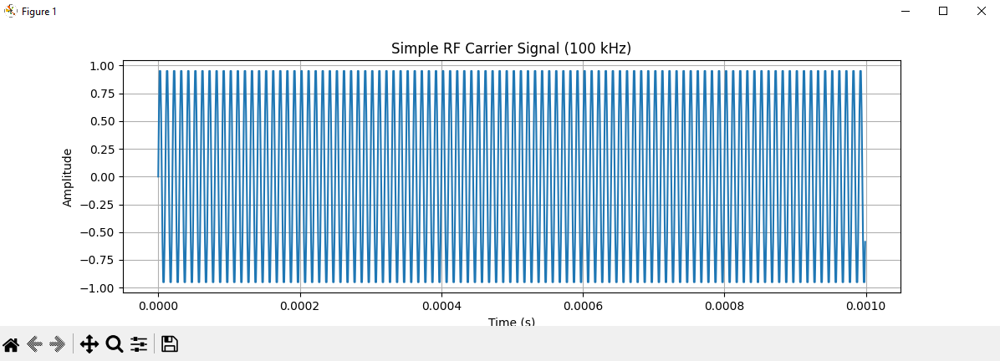
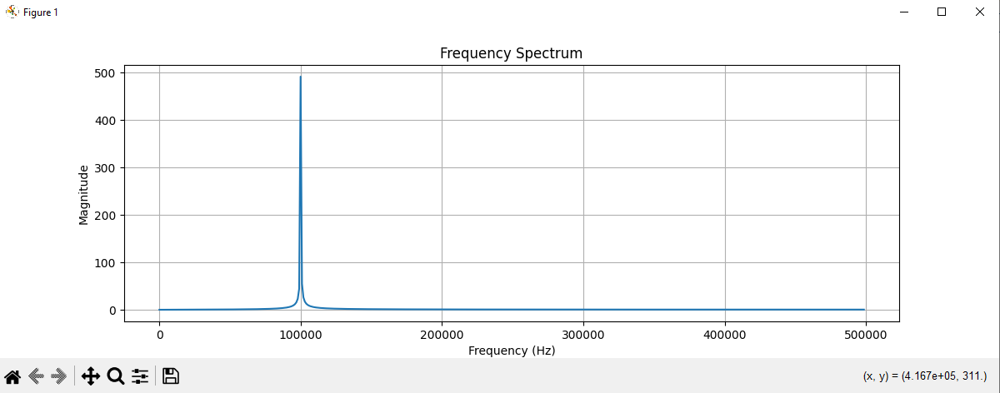
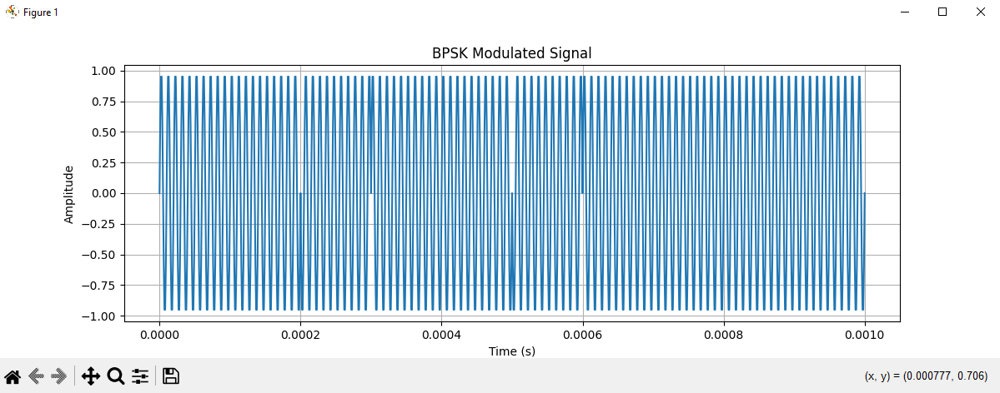
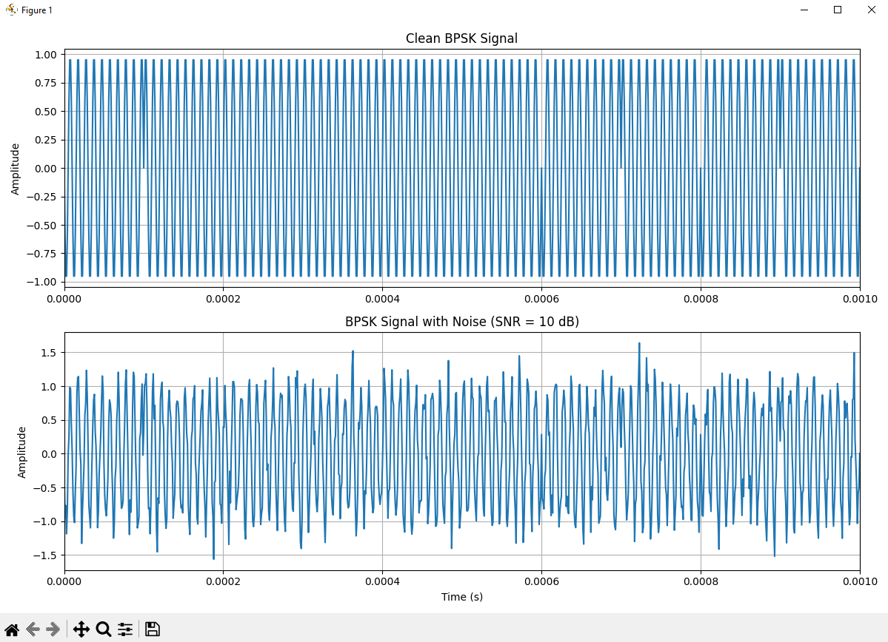
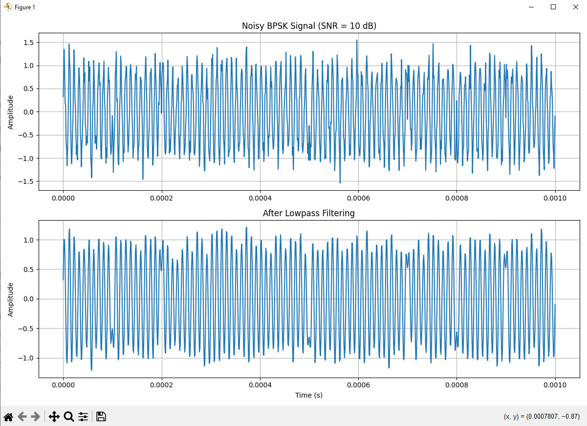
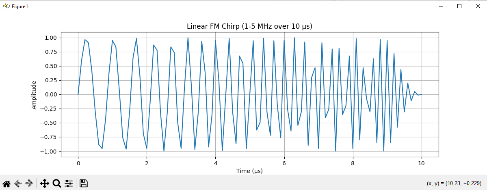
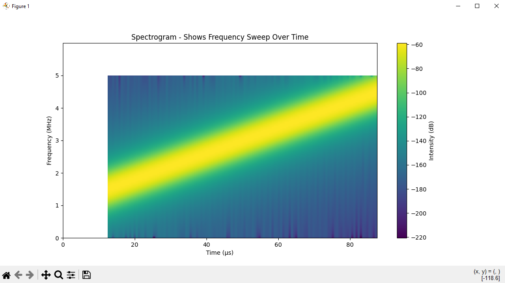
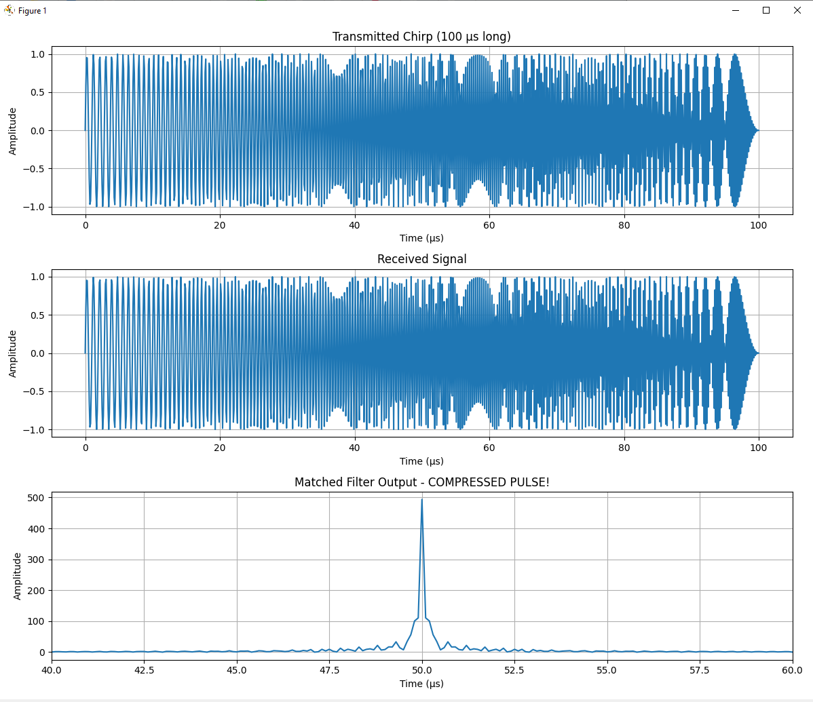
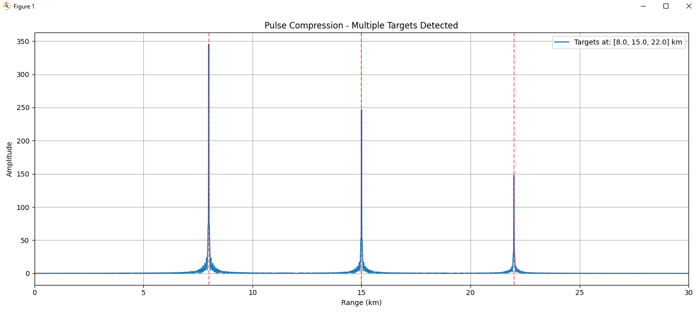

## Installation
In terminal:

git clone https://github.com/Preston752/rf-waveform-analyzer

cd rf-waveform-analyzer

pip install -r requirements.txt

**Requirements:**
- Python 3.12
- NumPy >= 1.24.0
- SciPy >= 1.10.0
- Matplotlib >= 3.7.0

# RF Waveform Generator and Analyzer

A Python-based RF signal processing toolkit demonstrating modulation, filtering, and analysis techniques.

## Features
- RF carrier signal generation
- Frequency domain analysis (FFT)
- Digital modulation (BPSK, QPSK)
- Signal filtering and noise analysis

### 1. Basic RF Carrier Signal

Generates a 100 kHz sine wave and analyzes it in both time and frequency domains.

Run in terminal: 
python examples/01_basic_carrier.py

**What it demonstrates:**
- RF signal generation
- Time-domain visualization

**Output:**

**Explanation:**
This is an RF carrier that oscillates at a 100 kHz frequency. In
the time domain, it appears as a repeating wave pattern. This wave
can be modulated later to transmit information. Displays a wave for 1 millisecond. 100 oscillations (spikes - up and down) and each oscillation has 10 samples/data points so the sine wave looks
smooth. 

Nyquist Theorem: also known as the Nyquist-Shannon sampling theorem, defines the conditions under which a continuous-time signal can be sampled and perfectly reconstructed from its samples, without losing any information. The Nyquist theorem holds that a continuous-time signal can be perfectly reconstructed from its samples if it is sampled at a rate greater than twice its highest frequency components.

https://www.mathworks.com/discovery/nyquist-theorem.html

So, I can use at least 201 kHz but 1 MHZ (1000 kHz) seems to work.

### 2. Frequency Spectrum

Performs Fast Fourier Transform (FFT) to convert the time-domain carrier signal into the frequency domain.

Run in terminal:
python examples/02_frequency_spectrum.py

**What it demonstrates:**
- FFT implementation
- Frequency domain analysis
- Identifying which frequencies are present in a signal

**Output:**

**Explanation:**
FFT: tests my signal against all possible frequencies. At least 100x faster than DFT (Discrete Fourier Transform).

https://arxiv.org/html/math/0302212/#:~:text=For%20a%20sample%20set%20of,of%20the%20Cooley%2DTukey%20algorithm.

### 3. BPSK Digital Modulation

Implements Binary Phase Shift Keying to encode digital data (0s and 1s) onto an RF carrier.

Run in terminal:
python examples/03_bpsk_modulation.py

**What it demonstrates:**
- Digital modulation techniques
- Phase shift keying (PSK)
- Encoding binary data onto RF carriers
- Data transmission over RF channels)

**Output:**

**Explanation:**
Digital data is transmitted by shifting the phase of the carrier - when the bit changes, the waveform inverts.

Encoding: Bit 0 = 0° phase (normal sine wave)
          Bit 1 = 180° phase (inverted sine wave)

Generates random bits.

If bit = 0: transmit sin(2pi * 100kHz * t)
If bit = 1: transmit -sin(2pi * 100kHz * t)

Good for noise resistant communication

### 4. Noise Analysis

Adds Additive White Gaussian Noise (AWGN) to simulate real-world RF channels.

Run in terminal:
python examples/04_noise_analysis.py

**What it demonstrates:**
- AWGN channel modeling
- Signal-to-Noise Ratio (SNR) analysis
- Effects of noise on signal quality
- Realistic communication channel simulation

**Output:**

**Explanation:** 
Real RF channels add noise that degrades signal quality. SNR determines detection capability. 

In real-world RF systems, transmitted signals always encounter noise from various sources: thermal noise in receivers, atmospheric interference, competing transmitters, and electronic components.

SNR = 10 dB: Signal power is 10x stronger than noise (moderate
conditions)

If SNR is higher = easier to identify signal

If SNR is lower = harder to identify signal

### 5. Signal Filtering

Implements a digital lowpass filter to remove high-frequency noise from the corrupted BPSK signal.

Run in terminal:
python examples/05_filtering.py

**What it demonstrates:**
- Digital filter design (Butterworth lowpass filter)
- Noise reduction techniques
- Before/after filtering comparison

**Output:**

**Explanation:** 
Filtering removes unwanted frequency components while preserving the signal of interest.

- 5th-order Butterworth lowpass filter
- Cutoff frequency: 150 kHz
- Zero-phase filtering (filtfilt)

BPSK carrier is at 100 kHz. Frequencies below 150 kHz pass through at full strength, but frequencies above 150 kHz are reduced in amplitude (weakened).

5th order filter: sharp enough to remove high-frequency noise without excessive complexity

Zero-phase filtering (filtfilt): Normal filters will introduce a phase distortion (time delay). Timing is very important for communication systems/radar, so this can create errors. 

filtfilt() can be used for offline processing, but not in real-time systems. Real-time systems do not know the end of the signal which is needed to reverse filter the signal, so real-time systems will need to deal with time delay using another method.

So, this zero-phase filter will:

filter forward (normal filter)

reverse signal

filter backward (filter reversed signal)

reverse back (to orginal time order)

### 6. Radar Chirp and Spectrogram Generation

Generates Linear Frequency Modulation (LFM) chirps used in modern radar systems.

Run in terminal:
python examples/06_radar_chirp.py

python examples/07_radar_spectrogram.py

**What it demonstrates:**
- Radar waveform synthesis
- Linear frequency modulation (chirp generation)
- Time-frequency analysis (spectrogram)

**Output:**

**Explanation:**
A chirp is a signal whose frequency increases (or decreases) linearly over time. 

This chirp will increase its frequency toward the end.
I lowered the duration to 10 microseconds so that you can clearly see the frequency is increasing over time.

The spectrogram (time-frequency plot - 100 microseconds) shows a bright color from 1 MHz - 5 MHz. There is a strong signal (bright color) in this range because the chirp's frequency is getting faster (linearly) as time moves forward. The dark areas are frequencies not present in the signal (these are areas that are not linearly increasing from the rate and start of the chirp).

Why use chirps for radar?

Radar systems need two conflicting things:

High energy -> detect distant targets -> needs LONG pulses

High resolution -> distinguish close targets -> needs SHORT pulses

The chirp solves this by:

Long duration/pulse (100 microseconds) -> high energy for detection

Wide bandwidth (4 MHz) - > high resolution after pulse compression

Matched filtering compresses it into a narrow spike (short pulse).

### 7. Pulse Compression (Matched Filtering)

Implements matched filtering to compress radar chirps and detect targets at specific ranges.

Run in terminal:
python examples/07_pulse_compression.py

**What it demonstrates:**
- Matched filtering algorithm
- Pulse compression technique
- Target detection and ranging
- Range resolution in radar systems
- Cross-correlation for signal processing

**Output:**

**Explanation:**

Transmit long chirp (100 microseconds) -> good for detection but can't separate close targets

Chirp travels to target and back -> the amount of time it takes to recieve the echo back will determine the target's distance from the chirp

Apply filter -> Cross-correlate received signal with transmitted chirp. The filter looks for the chirp pattern in the received signal. Produces a sharp spike when it finds a match.

Detect target -> The position of the spike in time will tell us exactly how far the target is from the start of the chirp.

The 3rd graph in image-7 shows the spike in 50 microseconds which
corresponds to 8 km range which is shown in image-8. Only the matched filter for the 8 km range is shown here.

image-8 also shows 2 other targets that have been detected.

Bigger target = stronger return = taller spike

Smaller target = weaker return = shorter spike

https://www.youtube.com/watch?v=Ey-Z93BbQ0Y
